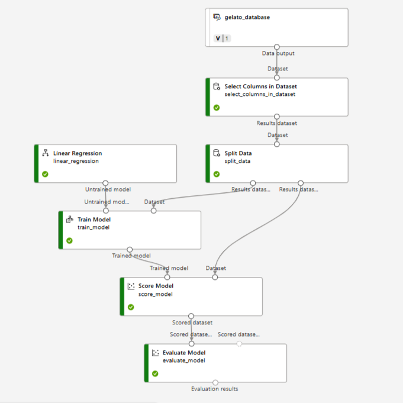

# Predictive sales using Azure Machine Learning

> Challenge created as part of the Microsoft Certification Challenge #3 DP-100 Bootcamp by DIO:

## Scenario

Imagine that you own an ice cream shop called Gelato Magic in a seaside town. You know that the amount of ice cream you sell each day is strongly correlated with the ambient temperature. However, without proper planning, you may end up producing more ice cream than necessary and incur losses due to waste, or conversely, produce less and lose sales.

To solve this problem, you decide to use machine learning to predict how much ice cream will be sold based on temperature. With this model, you can anticipate demand and plan production efficiently.

## Goal

The objective of this project is to develop a predictive regression model that allows:

✅ Train a Machine Learning model to predict ice cream sales based on the day's temperature.

✅ Register and manage the model using MLflow.

✅ Implement the model for real-time forecasting in a cloud computing environment.

✅ Create a structured pipeline to train and test the model, ensuring reproducibility.

---

## 1. Creating the database

To create the database was used a prompt in Copilot as below:

```
Create a sample database with 100 rows simulating ice cream sales based on date, sales, and temperature. The spreadsheet should be in CSV format.
```

The CSV file **gelato_database** can be found in the folder <a href= './inputs/dataset'>dataset</a>.

<br />

**Dataset Summary**

| Date       | Sales (units) | Temperature (°C) |
| ---------- | ------------- | ---------------- |
| 2025-01-01 | 150           | 25               |
| 2025-01-02 | 120           | 23               |
| 2025-01-03 | 180           | 28               |
| 2025-01-04 | 140           | 26               |
| 2025-01-05 | 160           | 27               |
| ...        | ...           | ...              |

## 2. Step-by-step to create a project in Azure Machine Learning

### 2.1. Setting the environment in Azure Machine Learning

- First, create a new _resource group_ in Azure Portal

- Search for _Machine Learning_ in the Azure portal and provision a new Azure Machine Learning resource.

- Navigate to the Azure Machine Learning Studio to manage your machine learning resources.

### 2.2. Setting compute instances and uploading the dataset

- In Azure Machine Learning Studio, select the _Compute_ option and set an instance in **Compute instances** to tests and **Compute clusters** to model training.

- Now, select the _Data_ option and create a new dataset. Upload the CSV file **gelato_database**.

- In the *Schema* tab unselect the "Date" column, because won't be relevant to the model training.

- To finish, create the data asset.

- In this project, the prediction model has been created using both the _Designer_ option with a pipeline model and the _Automated ML_ option with an automated machine learning process.

### 3. Pipeline Model

#### 3.1. Setting the Pipeline Model

- The first prediction model is using the _Designer_ option.

- On the left-hand menu on the screen, select _Designer_.

<div align="center">
     
</div>
<div align="center">Designer option</div>
<br />

- Create a **new pipeline using classic prebuilt components**.

- On the search menu, select the dataset in *Data* and drop it into the pipeline board.

- Then, search for **Select Columns in Dataset** and drop it into the pipeline connecting to data. Click in it and add the two columns in dataset: *Sales* and *Temperature*.

- Then, search for **Split Data** and drop it into the pipeline connecting to *Select Columns in Dataset*. Click in the Split Data and set the **Fraction of rows in the first output dataset** option to **0.2**.

- Search for **Train Model** and drop it into the pipeline connecting to *Split Data*

- Search for **Linear Regression** and drop it into the pipeline connecting to *Train Model*. Click in the *Train Model*, then click in **Edit column** in *Label Column* and select the target column as *Sales*.

- Search for **Score Model** and drop it into the pipeline connecting to *Train Model* and *Split Data*.

- Finally, search for **Evaluate Model** and drop it into the pipeline connecting to *Score Model*.

- To finish, click in **Configure & Submit** to start the training.

<div align="center">
     
</div>
<div align="center">Pipeline model</div>

#### 3.2. Trained Model

- The metrics of the model are shown below:

<div align="center">
     
</div>
<div align="center">Metrics of the pipeline</div>
<br />

- Below are the scored label values with a good accuracy:

<div align="center">
     
</div>
<div align="center">Scored dataset</div>

### 4. Automated Machine Learning

#### 4.1. Setting the Automated Machine Learning process

- On the left-hand menu on the screen, select _Automated ML_.

<div align="center">
     
</div>
<div align="center">Automated ML option</div>
<br />

- Adjust the task settings, including:

  - Metric definitions
  - Allowed models
  - Limits and settings for validation and testing

- The used parameters is shown below:

```
Task settings:

    Task type: Regression
    Dataset: gelato_dataset
    Target column: Sales (units) (integer)
    Additional configuration settings:
        Primary metric: NormalizedRootMeanSquaredError
        Explain best model: Selected
        Enable ensemble stacking: Unselected
        Use all supported models: Unselected. You’ll restrict the job to try only a few specific algorithms.
        Allowed models: Select only KNN, RandomForest and XGBoosterRegressor

    Limits: Expand this section
        Max trials: 0
        Max concurrent trials: 0
        Max nodes: 2
        Metric score threshold: 0
        Experiment timeout: 15
        Iteration timeout: 15
        Enable early termination: Selected

    Validation and test:
        Validation type: Automatic
        Test data: None

    Compute:
        Select compute type: Compute cluster
```

- After configuring the settings, submit the training job to begin the model training process.

#### 4.2. Trained Models

- Once the AutoML job is complete, review the best model trained by the system.

- In this training, the best model was the `Random Forest`, which had the best training performance. The *Normalized root mean squared error* was **0.014714** and duration of **31 seconds**.

- The metrics of the model are shown below:

<div align="center">
     
</div>
<div align="center">Metrics of the model</div>
<br />

- The hyperparameters of the model are shown below:

<div align="center">
     
</div>
<div align="center">Hyperparameters of the model</div>

### 4.3. Review the training

- The following diagram illustrates the data preprocessing, feature engineering, scaling techniques and the machine learning algorithm that Automated ML applied to generate this particular model.

<div align="center">
     
</div>
<div align="center">Data flow</div>
<br />

- The _Residuals_ graph shows the distribution of errors made by the model:

<div align="center">
     
</div>
<div align="center">Residuals histogram</div>
<br />

- The graph below compares the predicted values with the true values from the test set:

<div align="center">
     
</div>
<div align="center">Comparation of predicted and true values graphs</div>

### 4.4. Deploy the Best Model

- With the best model selected, you can deploy it. The `Real-time endpoint` option was used to deploy the model.

- Once the deployment is complete, you can test the model by sending requests to the `Real-time endpoint`.

### 4.5. Input Data for Testing

- To test the model, replace the sample JSON input with your own data. Below are two examples of the input used:

**Model:**

```
{
    "input_data": {
        "columns": [
            "Temperature (°C)"
        ],
        "index": [],
        "data": []
    }
}
```
<br />

**Input Test 01:**

```
{
    "input_data": {
        "columns": [
            "Temperature (°C)"
        ],
        "data": [
            {
                "Temperature (°C)": 32
            }
        ]
    }
}
```
<br />

**Input Test 02:**

```
  {
    "input_data": {
        "columns": [
            "Temperature (°C)"
        ],
        "data": [
            {
                "Temperature (°C)": 24
            }
        ]
    }
}
```

### 4.6. Output

**Output Test 01:**

```
[
    210
]
```
With a temperature of 32 Celsius degree, the predicted value for sales are 210 units of ice cream.

<br />

**Output Test 02:**

```
[
    140
]
```
With a temperature of 24 Celsius degree, the predicted value for sales are 140 units of ice cream.